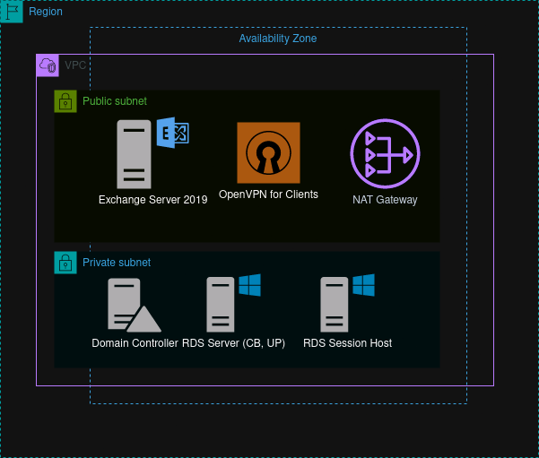

My first collection of playbooks - creates a Windows Test Environment within AWS. This contains a Domain Controller, Exchange Server and RDS Environment, with a public and private subnet, NAT Gateway and OpenVPN server.

End goal:

NOTE: Definitely need to streamline the defined variables to avoid repeating them!

Create VPC in London
ansible-playbook create_vpc.yml --extra-vars="aws-region eu-west-2

Get all EC2 instances - https://docs.ansible.com/ansible/latest/plugins/inventory.html#inventory-plugins
ansible-inventory -i all.aws_ec2.yml --graph

Run playbook on EC2 instance (only tested with one but should work with multiple), uses SSH keypair:
ansible-playbook -u ubuntu -i demo.aws_ec2.yml temp_playbook.yml --key-file "~/.ssh/windows_domain_keypair.pem" 

Connect to VPN using nmcli:
nmcli connection import type openvpn file client.ovpn
nmcli connection up client
